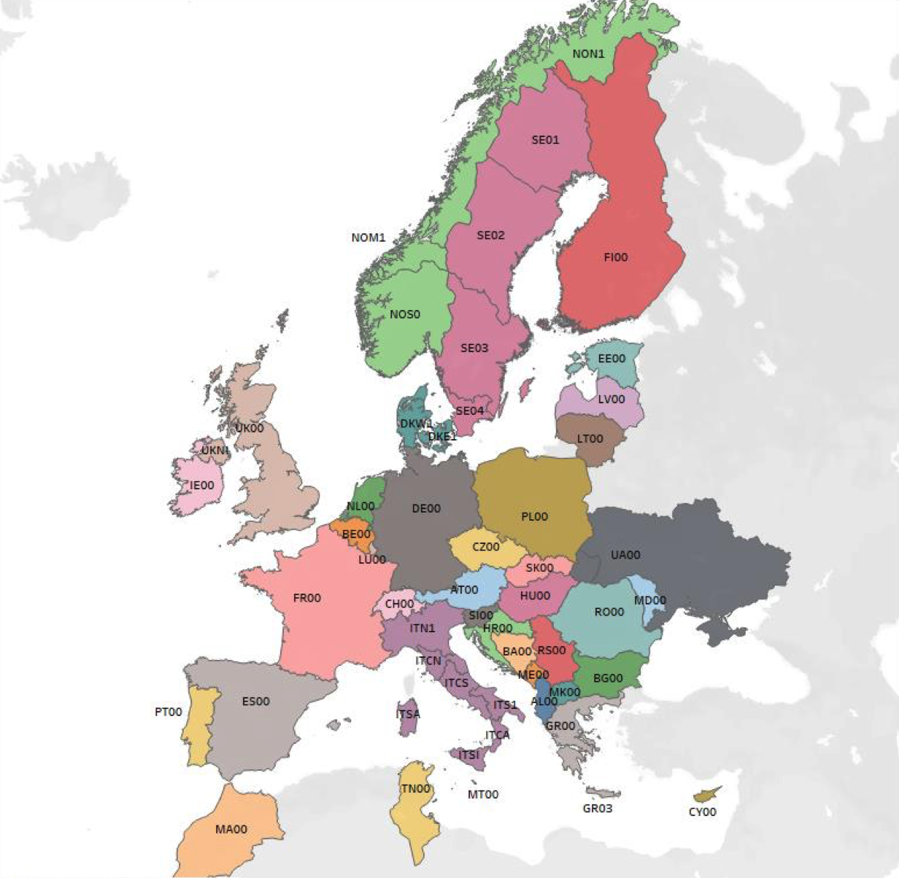

# TYNDP_Translator

This repository contains a Python script that extracts, processes, and formats data from the TYNDP2024 dataset to make it compatible with the LEGO energy system optimization model.

## Features

- Converts TYNDP2024 input data into the LEGO format.
- Updates electric line parameter X using PyPSA data.
- Estimates X for connections missing in PyPSA data based on the relationship between X and Pmax observed in the existing PyPSA dataset.
- Cleans up data to ensure only necessary information is stored in Excel files. This also allows selective inclusion of bidding zones by removing unwanted zones from Power_BusInfo.xlsx before running the cleanup.

## Result

- A model with one node per bidding zone for the ENTSO-E region.
- While ENTSO-E relies on an NTC model, the derived line parameters from PyPSA data enable the model’s use in a DC-OPF setup with one node per bidding zone.

<figure>
    
    <figcaption>Figure 1: Bidding Zones according to ENTSO-E.</figcaption>
</figure>